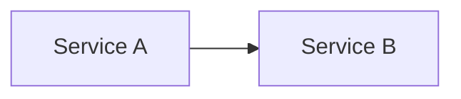

# GitHub Copilot Instructions for ArchitectJourney

**Version**: 3.3  
**Last Updated**: December 24, 2025  
**Critical Principle**: Update this file IMMEDIATELY when repository structure changes

---

## 🎯 Primary Directives

### 1. Automation-First Approach (NEW)

✅ **ALWAYS**: Create reusable PowerShell scripts for repetitive tasks  
✅ **ALWAYS**: Use existing scripts in `tools/psscripts/` first  
✅ **ALWAYS**: Enhance existing scripts rather than duplicating  
❌ **NEVER**: Execute individual commands for tasks repeated 2+ times

**Decision Tree**:

1. Check `tools/psscripts/` for existing script
2. Enhance existing script if close match
3. Create new `.ps1` for any repeated task
4. Document with examples and parameters

**Available Automation** (tools/psscripts/):

- `Get-FileStats.ps1` - File statistics analysis
- `Get-MarkdownSummary.ps1` - Markdown file analysis
- `Get-RepoStats.ps1` - Repository overview
- `Compare-DocFiles.ps1` - Compare multiple files
- `Find-DuplicateContent.ps1` - Find duplicate headings
- `Quick-HealthCheck.ps1` - Fast workspace health check

### 2. Update Verification Protocol (CRITICAL)

**After ANY structural change, IMMEDIATELY update**:

1. ✅ **`docs/02_repository-structure.md`** - **UPDATE THIS FIRST** (Single source of truth, if exists)
2. ✅ This file (.github/copilot-instructions.md) - Repository Structure section
3. ✅ `.cursor/rules/02_repository-structure.mdc` - Repository structure rules
4. ✅ README.md - Repository Structure section
5. ✅ Relevant documentation files
6. ✅ Run verification: `.\Quick-HealthCheck.ps1` from tools/psscripts/

**Self-Check Question**: "Did I update the repository structure documentation?" - If no, STOP and do it NOW.

**Note**: If `docs/02_repository-structure.md` doesn't exist, create it as the single source of truth for repository structure, then reference it from other files.

### 3. Chain-of-Thought + ReAct + Reasoning

**Apply systematic reasoning to every task using this framework**:

#### Chain-of-Thought (CoT)

Break down complex problems into logical steps:

- **Decompose**: Split large tasks into smaller, manageable components
- **Sequential Logic**: Show clear progression from problem → solution
- **Explicit Reasoning**: Articulate WHY each step is necessary
- **Intermediate Steps**: Don't jump to conclusions; show the work

**Example**: "To consolidate docs, I need to: 1) Read all files, 2) Identify unique content, 3) Extract and merge, 4) Verify no loss, 5) Update references"

#### ReAct (Reasoning + Acting)

Interleave thinking with action in iterative cycles:

1. **OBSERVE** 🔍
   - Current state: What exists now?
   - User request: What is being asked?
   - Context: What's the broader situation?
   - Constraints: What limitations exist?

2. **ANALYZE** 🧠
   - Root cause: Why does this issue exist?
   - Dependencies: What else is affected?
   - Implications: What are the consequences?
   - Alternatives: What other approaches exist?

3. **PLAN** 📋
   - Step-by-step approach with clear milestones
   - Verification points at each step
   - Rollback strategy if issues arise
   - Resource requirements (scripts, tools, time)

4. **ACT** ⚡
   - Execute with automation where possible
   - Use existing scripts before creating new ones
   - Make incremental changes, not big bangs
   - Document as you go

5. **VERIFY** ✅
   - Check results against expected outcomes
   - Run validation tools (markdownlint, Quick-HealthCheck)
   - Update documentation (THIS FILE, README.md)
   - Test edge cases

6. **REFLECT** 🤔
   - What worked well?
   - What could be improved?
   - What would prevent this issue in the future?
   - Update instructions/scripts based on learnings

#### System 2 Reasoning

**Engage deliberate, analytical thinking for complex decisions**:

- **Question Assumptions**: Don't accept requirements at face value
- **Consider Trade-offs**: Every decision has pros and cons
- **Think Long-term**: How will this affect future work?
- **Pattern Recognition**: Have we solved similar problems before?
- **Meta-cognition**: Monitor your own reasoning process

**Red Flags Requiring Deep Analysis**:

- ⚠️ Structural changes (affects multiple files)
- ⚠️ Deletions (potential information loss)
- ⚠️ Consolidations (complexity in merging)
- ⚠️ New patterns (precedent-setting decisions)
- ⚠️ User frustration (indicates process failure)

#### Practical Application

**For Simple Tasks** (read file, create script):

- Quick CoT: "Need to read file → use read_file tool → done"
- Minimal reasoning sufficient

**For Complex Tasks** (consolidate docs, restructure):

- Full ReAct cycle required
- Multiple OBSERVE → ANALYZE → PLAN → ACT → VERIFY iterations
- Deep System 2 reasoning for critical decisions
- Document reasoning in commit messages

**When User Points Out Mistakes**:

1. **Acknowledge**: "You're right, I missed X"
2. **Root Cause**: "This happened because..."
3. **Immediate Fix**: Correct the issue
4. **Prevention**: "I'm adding [protocol/check/script] to prevent recurrence"
5. **Update Instructions**: Modify THIS FILE to embed learning

---

## 📁 Current Repository Structure (AS OF NOVEMBER 24, 2025)

### **Actual Current Structure** (verify with: `tree /F /A`)

```text
ArchitectJourney/
├── .copilot/                              # Copilot configuration
│   └── settings.json
├── .cursor/                               # Cursor AI configuration
│   └── rules/                             # Project rules and guidelines
│       ├── 01_educational-content-rules.mdc
│       ├── 02_repository-structure.mdc
│       ├── 03_quality-assurance.mdc
│       ├── 04_markdown-standards.mdc
│       ├── 05_primary-directives.mdc
│       ├── 06_cross-domain-integration.mdc
│       ├── 07_file-naming-conventions.mdc
│       └── README.md
├── .github/                               # GitHub configuration
│   ├── copilot-instructions.md            # THIS FILE - Update when structure changes
│   └── prompts/                           # Reusable prompt templates
│       ├── smart-prompt-framework-guide.md
│       └── task-prompt.md
├── docs/                                  # Documentation hub
│   ├── 01_GitHub-Organization-Strategy.md  # GitHub organization setup guide
│   ├── 02_Workspace-Review-2025-11-23.md   # Workspace review and recommendations
│   ├── review-reports/                     # All review reports (migration, content review, etc.)
│   │   └── [DDMonYYYY.md]                 # Example: 24Nov2025.md (date-based naming)
│   └── images/                            # Architecture diagrams and assets
│       └── .gitkeep
├── LICENSE                                 # MIT License
├── README.md                               # Main repository documentation
├── source-material/                        # Staging area (at repository root, git-ignored)
├── src/                                    # Source content (organized)
│   ├── 01_Reference/                      # Reference library
│   ├── 02_Learning/                       # Learning paths
│   └── 03_Interview-Prep/                 # Interview preparation
└── .gitignore                             # Git ignore rules
```

### **Actual Current Structure** (Updated November 24, 2025)

```text
ArchitectJourney/
├── .copilot/                              # Copilot configuration
├── .cursor/                               # Cursor AI configuration
├── .github/                               # GitHub configuration
├── docs/                                  # Documentation hub
├── src/                                   # Source content (organized)
│   ├── 01_Reference/                     # Reference library (static knowledge)
│   │   ├── 01_Development/               # Software development fundamentals
│   │   ├── 02_AI-and-ML/                 # AI/ML knowledge base
│   │   └── 05_DevOps/                    # DevOps practices and tools
│   ├── 02_Learning/                       # Learning paths content (coming soon)
│   └── 03_Interview-Prep/                # Interview preparation materials
│       ├── Common/                       # Shared interview content
│       ├── TPM/                          # Technical Project Manager prep
│       ├── Architect/                    # Software Architect prep
│       ├── Solution-Architect/           # Solution Architect prep
│       └── Engineering-Manager/          # Engineering Manager prep
├── source-material/                       # Staging area (at repository root, git-ignored)
└── tools/                                 # Automation and utilities
    └── psscripts/                         # PowerShell automation scripts
```

### **Documentation Philosophy**

**Current Documentation** (as of November 23, 2025):

1. **01_GitHub-Organization-Strategy.md** - GitHub organization setup and multi-repository strategy
   - Organization creation and configuration
   - Repository naming conventions
   - Multi-repository architecture

2. **02_Workspace-Review-2025-11-23.md** - Workspace review and recommendations
   - Current state assessment
   - Implementation checklist
   - Next steps and recommendations

**Planned Documentation** (to be created):

- **01_UnifiedArchitectMasteryRoadmap.md** - Complete 9-stage learning roadmap (planned)
- **02_repository-structure.md** - Repository organization reference (single source of truth)
- Additional documentation as content is developed

---

## 🧭 Repository Context & Purpose

**ArchitectJourney** is a comprehensive learning and reference repository for aspiring software architects. It provides:

- Structured learning roadmap from foundational programming to architectural mastery
- Reference materials for design patterns, principles, and best practices
- Practical project examples and implementation guides
- Leadership and strategic frameworks for technical decision-making

**Target Audience**: Developers → Software Architects → Lead Architects → Technology Directors

**Learning Framework**: 9-stage unified progression combining core architecture fundamentals with leadership development

---

## 📋 Educational Content Rules (ArchitectJourney Knowledge Base)

### 🚨 CRITICAL: Repository Purpose & Code Separation

**This repository (`ArchitectJourney`) is EXCLUSIVELY for educational content:**

- ✅ **Educational Content Only**: Markdown documentation, learning materials, concepts, and illustrative code examples
- ✅ **Minimal Code Examples**: Code snippets in educational content should be minimal, illustrative, and focused on teaching concepts
- ❌ **NO Full Implementations**: Complete, runnable code projects are NOT stored in this repository
- ❌ **NO Code Repositories**: This repository does not contain language-specific code implementations

**Code Implementations Location:**

All full code implementations, projects, and runnable examples are stored in **separate GitHub repositories** within the same organization (`SwamysArchitectJourney-2026`):

- `Python` - Python implementations
- `CSharp` - C# and .NET projects
- `JavaScript` - JavaScript/TypeScript projects
- `Java` - Java and Spring Boot
- `Go` - Go projects
- `Cloud` - Infrastructure as Code
- `AI-ML` - AI/ML implementations

**Code Examples in Educational Content:**

When including code examples in educational content:
- ✅ Use minimal, illustrative snippets to demonstrate concepts
- ✅ Focus on teaching, not complete implementations
- ✅ Reference full implementations in separate code repositories
- ❌ Do not include complete, production-ready code
- ❌ Do not create runnable projects in this repository

### 🚫 Zero-Copy Policy (Non-Negotiable)

**CRITICAL**: All educational content must be transformative, not reformative.

❌ **NEVER** copy text verbatim from books, articles, websites, videos, or third-party materials  
❌ **NEVER** mirror a source's outline, section order, headings, or example sequence  
❌ **NEVER** use "light paraphrasing" — must transform completely  
✅ **ALWAYS** create diagrams in Mermaid-first style with ASCII fallback (never embed copyrighted figures)  
✅ **ALWAYS** write fresh, minimal code from first principles  
✅ Brief quotations allowed ONLY with quotation marks and source citation

### 🔄 Transformative Workflow (Required Every Time)

**Step-by-step process for creating original educational content**:

1. **Source Intake**: Skim for intent and big ideas; don't copy notes verbatim
2. **Concept Map**: Create fresh outline with different sectioning tailored to ArchitectJourney
3. **Teach Differently**: Use new analogies, scenarios, datasets, use-cases (avoid source examples)
4. **Produce Original Artifacts**: Explanations, Mermaid diagrams (with ASCII fallback), minimal examples
5. **Cross-Link in ArchitectJourney**: Add prerequisites/builds-upon/enables across tracks
6. **Similarity Audit**: Ensure no sentences/structures resemble source
7. **Optional References**: Add "References/Inspired by" links (no copied phrasing)

**Goal**: Create transformative educational content, not just reformative. Entirely new presentation, examples, and explanations that teach the same concepts through original methods.

### 🎯 Interview Preparation Content Guidelines

**CRITICAL**: All interview preparation content in `03_Interview-Prep/` must be **generic and company-agnostic**.

#### Generic Content Policy

❌ **NEVER** include company-specific names (Microsoft, Amazon, Google, Meta, etc.)  
❌ **NEVER** reference company-specific frameworks by name (e.g., "Amazon Leadership Principles")  
❌ **NEVER** create company-specific interview scripts or answers  
✅ **ALWAYS** use generic descriptions (e.g., "Leadership Principles", "Clarity–Energy–Success model")  
✅ **ALWAYS** frame content for broad applicability across organizations  
✅ **ALWAYS** focus on universal principles and practices  

**Rationale**: Interview prep content should be applicable to any organization, not tied to specific companies. This makes the content more valuable and reusable.

**Examples of Generic Framing**:
- ❌ "Amazon Leadership Principles" → ✅ "Leadership Principles (ownership, customer focus, bias for action)"
- ❌ "Microsoft's Clarity–Energy–Success model" → ✅ "Clarity–Energy–Success model (bringing clarity, energizing teams, driving success)"
- ❌ "For Amazon, AWS roles" → ✅ "For high-pressure TPM roles, customer-obsessed organizations"
- ❌ "For Google, Meta, Stripe, Uber" → ✅ "For deep-tech companies, innovation-focused organizations"

**When Creating Interview Prep Content**:
1. Focus on universal principles and practices
2. Use generic organizational types (product companies, startups, enterprise organizations)
3. Reference frameworks by their concepts, not company names
4. Make content applicable to any similar organization

### ⏱️ 25-Minute Learning Segments

✅ **Modular content** designed for focused 25-minute sessions  
✅ **Multi-Part Structure**: Complex topics split into Part 1, Part 2, ... Part N  
✅ **One-Shot Learning**: Each segment complete and actionable within time limit  
✅ **Target Length**: 150 lines of content maximum per response

#### ⚠️ CRITICAL: Splitting vs. Trimming Policy

**MANDATORY APPROACH**: When content exceeds 150 lines, **ALWAYS SPLIT** into multiple parts. **NEVER TRIM** or condense content.

**Why Splitting is Required:**
- ✅ **Preserves ALL educational content** - No loss of examples, explanations, or concepts
- ✅ **Maintains learning value** - Each part remains complete and actionable
- ✅ **Better learning experience** - Learners get comprehensive coverage across parts
- ✅ **Follows 25-minute principle** - Each part fits within focused learning session

**Why Trimming is Prohibited:**
- ❌ **Loses educational content** - Examples, explanations, or concepts may be removed
- ❌ **Reduces learning value** - Condensed content may miss important details
- ❌ **Violates zero-copy policy** - If source had comprehensive content, we should preserve it
- ❌ **Poor learning experience** - Learners miss important information

**Splitting Process:**
1. **Identify logical breakpoints** - Split at natural topic boundaries
2. **Preserve all content** - Move content to appropriate part, don't delete
3. **Maintain completeness** - Each part should be self-contained and complete
4. **Use semantic naming** - Name files by their content concept (e.g., `fundamentals.md`, `advanced.md`). See [File Naming Conventions](../.cursor/rules/07_file-naming-conventions.mdc) for the new standard.
5. **Update references** - Update all file references after splitting

**⚠️ NAMING CONVENTION UPDATE**: The `Part1-A`, `Part1-B` pattern is deprecated. All new content must use semantic names. See [File Naming Conventions](../.cursor/rules/07_file-naming-conventions.mdc) for details.

### 📋 Required Content Structure

#### 5 Required ArchitectJourney Metadata Fields

Every educational content file MUST include:

```yaml
---
learning_level: "Beginner" | "Intermediate" | "Advanced"
prerequisites: ["required knowledge", "prior concepts"]
estimated_time: "25 minutes"  # Standard, adjust if needed
learning_objectives:
  - "Specific, measurable outcome 1"
  - "Specific, measurable outcome 2"
related_topics:
  prerequisites: ["../prerequisite-content/"]
  builds_upon: ["../foundational-content/"]
  enables: ["../advanced-content/"]
  cross_refs: ["../related-domains/"]
---
```

#### Numbering Convention

✅ **ALWAYS** use zero-padded numeric prefixes starting at `01_`  
❌ **NEVER** use `00_` prefixes - **NO EXCEPTIONS**  
✅ Keep numbering stable; add new numbers rather than renumbering widely  
✅ Use hyphens for multi-word names: `01_Software-Design-Principles/`

**CRITICAL**: This rule applies to **ALL files** in the repository:
- ✅ Educational content files (`01_Reference/`, `02_Learning/`)
- ✅ Documentation files (`docs/`)
- ✅ Any numbered files anywhere in the repository
- ❌ **NO EXCEPTIONS** - `00_` is NEVER allowed, even for meta/documentation files

**Why This Rule Exists**:
- Maintains consistent numbering across the repository
- Prevents confusion about file ordering
- Ensures predictable file organization
- `01_` clearly indicates the first item, `00_` is ambiguous

#### Learning Order Requirements (CRITICAL)

**CRITICAL**: File numbering MUST reflect logical learning dependencies, not arbitrary ordering.

**Standard OOP Learning Progression** (01_Reference/01_Development/01_Software-Design-Principles/):

1. **01**: OOP Introduction - Understanding the paradigm
2. **02**: Classes and Objects - Core building blocks
3. **03**: Encapsulation and Abstraction - Data protection
4. **04**: Inheritance and Polymorphism - Code reuse (fundamental OOP pillar)
5. **05**: Composition and Interfaces - Advanced patterns (compares with inheritance)
6. **06**: UML Class Relationships - Visualizing relationships

**Why This Order Matters**:
- Inheritance (04) must come BEFORE Composition (05) because Composition discusses "favor composition over inheritance" - learners need to understand inheritance first
- Inheritance is a fundamental OOP pillar; Composition is an alternative/comparison
- UML (06) comes last as it visualizes all previous concepts

**When Creating New Content**:
- ✅ Verify prerequisites are numbered BEFORE the new content
- ✅ Check that "enables" relationships point to content numbered AFTER
- ✅ Ensure learning dependencies match file numbering order
- ❌ NEVER place content that depends on later-numbered files

#### File Naming Convention for Split Files

**⚠️ DEPRECATED**: The `Part1-A`, `Part1-B` pattern is deprecated. See [File Naming Conventions](../.cursor/rules/07_file-naming-conventions.mdc) for the new standard.

**NEW STANDARD**: Use semantic names that describe the content concept.

**Core Principle**: Files should represent concepts. Folders should represent structure. Numbers should represent ordering — sparingly.

**When splitting files**:
1. **Identify distinct concepts** - Split at natural topic boundaries
2. **Use semantic names** - Name files by their content, not by sequence
3. **Use folders for structure** - When content groups naturally, use folders

**Examples** (New Standard):
- ✅ `fundamentals.md`, `advanced.md` (semantic names)
- ✅ `core-concepts.md`, `system-design.md` (semantic names)
- ✅ `01_fundamentals.md`, `02_advanced.md` (only if sequence matters)

**Examples** (Old Pattern - Deprecated):
- ❌ `Topic-Part1-A.md` (avoid - encodes hierarchy in filename)
- ❌ `Topic-Part1-B.md` (avoid - encodes hierarchy in filename)
- ❌ `Topic-Part1-B-A.md` (avoid - brittle and confusing)

**Migration**: Existing files using `Part1-A` patterns remain for backward compatibility, but all new content must use semantic names. See [File Naming Conventions](../.cursor/rules/07_file-naming-conventions.mdc) for details and migration strategy.

**Decision Framework**:
- If content > 150 lines → Can it be split into distinct concepts?
  - Yes → Separate files with semantic names
  - No → Is there a learning sequence?
    - Yes → Numbered files: `01_`, `02_`, etc.
    - No → Semantic names: `fundamentals.md`, `advanced.md`

### 🔗 File Reference Requirements (CRITICAL)

#### Mandatory Practices

**CRITICAL**: All file references MUST point to existing files or be clearly marked as planned content.

#### When Creating File References

1. ✅ **Verify file exists** before adding reference
2. ✅ **Use exact file names** - match actual file names exactly (including all part suffixes)
3. ✅ **Test references** - run `.\tools\psscripts\Validate-FileReferences.ps1` after adding references
4. ✅ **Update after splitting** - when splitting files, update ALL references to that file immediately

#### When Splitting Files

**CRITICAL WORKFLOW**:

1. Create new part files
2. **IMMEDIATELY** run: `.\tools\psscripts\Validate-FileReferences.ps1` to find all references
3. Update ALL references to point to correct part files
4. Run validation again to verify
5. Test navigation manually

#### Reference Patterns

- **Prerequisites/Builds Upon**: Use semantic file names (e.g., `fundamentals.md`) or specific file if needed
- **Enables**: Can reference any related file, typically next in learning sequence
- **Planned Content**: References to files that don't exist yet are acceptable IF clearly marked as planned
- **Note**: With new semantic naming, references should use meaningful names rather than `Part1-A` patterns

#### Validation Checklist

Before committing:
- [ ] Run `.\tools\psscripts\Validate-FileReferences.ps1`
- [ ] All references point to existing files (or are clearly planned)
- [ ] Navigation links work in markdown preview
- [ ] No broken references remain

---

### 🔍 Comprehensive Content Review Process

**MANDATORY**: All content in `01_Reference/`, `02_Learning/`, and `03_Interview-Prep/` folders must undergo comprehensive review using CoT (Chain-of-Thought), ReAct (Reasoning + Acting), and systematic reasoning.

**🚨 CRITICAL RULE ALIGNMENT**: Migration and Review use **THE EXACT SAME RULES AND CHECKLIST**. The 7-category Individual File Review Checklist MUST be applied during migration/transformation, not just during review. This ensures all content is compliant from the moment it's created.

#### Review Request Protocol

**When a review is REQUESTED**:

- ✅ **MANDATORY**: Review EACH AND EVERY file individually - no file should be skipped
- ✅ **MANDATORY**: Open and examine every file in the specified scope
- ✅ **MANDATORY**: Apply the 7-category review checklist to every single file
- ❌ **NEVER**: Skip files, assume compliance, or review only a sample
- ❌ **NEVER**: Review only files that "look problematic" - review ALL files

**Scope of Review**:
- If reviewing `01_Reference/` folder: Review ALL files in `01_Reference/`
- If reviewing `02_Learning/` folder: Review ALL files in `02_Learning/`
- If reviewing a specific subfolder: Review ALL files in that subfolder
- If reviewing specific files: Review each requested file individually

#### Review Methodology

**Use CoT, ReAct, and Reasoning for every review**:

1. **OBSERVE**: Systematically scan and catalog all files
   - List every file in the review scope
   - No file should be excluded or skipped
2. **ANALYZE**: Review each file individually with deep analysis
   - Open and examine every file
   - Apply review checklist to each file
3. **REASON**: Apply logical reasoning to identify issues and patterns
4. **VERIFY**: Cross-check findings and validate compliance
5. **ACT**: Document findings and update content as needed

#### Individual File Review Checklist

**Review EACH AND EVERY file individually** - no file should be skipped:

##### 1. YAML Frontmatter Review
- [ ] YAML frontmatter present (starts with `---`)
- [ ] All 5 required metadata fields present:
  - [ ] `learning_level` (Beginner/Intermediate/Advanced/Reference)
  - [ ] `prerequisites`
  - [ ] `estimated_time`
  - [ ] `learning_objectives`
  - [ ] `related_topics` (with `enables:` key)
- [ ] No placeholder patterns (`$101_`, `$102_`, etc.)
- [ ] YAML syntax is valid
- [ ] `enables:` key present in `related_topics` section

##### 2. Content Structure Review
- [ ] File length ≤ 150 lines (excluding YAML frontmatter)
- [ ] **If content exceeds 150 lines**: File has been SPLIT into multiple parts (not trimmed)
- [ ] All educational content preserved across split parts
- [ ] Has clear headings (## level)
- [ ] Content is modular and focused
- [ ] Follows 25-minute learning segment principle

##### 3. File Naming Review
- [ ] Uses zero-padded numeric prefix (`01_`, `02_`, etc.) - only when sequence matters
- [ ] **CRITICAL**: Never uses `00_` prefix - **NO EXCEPTIONS** (applies to ALL files including `docs/`)
- [ ] **NEW STANDARD**: Split files use semantic names (e.g., `fundamentals.md`, `advanced.md`) - see [File Naming Conventions](../.cursor/rules/07_file-naming-conventions.mdc)
- [ ] **DEPRECATED**: Old `Part1-A.md`, `Part1-B.md` pattern is deprecated for new content
- [ ] Hyphens used for multi-word names
- [ ] Rule applies to educational content AND documentation files
- [ ] Filenames represent concepts, not editorial accidents

##### 4. File References Review
- [ ] All `enables:` references point to existing files
- [ ] All `prerequisites:` references point to existing files
- [ ] All `builds_upon:` references point to existing files
- [ ] File names in references match actual file names exactly
- [ ] No broken references remain

##### 5. Content Quality Review
- [ ] Has code examples (if applicable)
- [ ] Has diagrams (Mermaid or ASCII)
- [ ] Content is transformative (not copied)
- [ ] No suspicious patterns (Copyright, "All rights reserved", etc.)
- [ ] Learning objectives are clear and measurable
- [ ] Progressive scaffolding present (Foundations → Practice → Pitfalls → Next Steps)

##### 6. Zero-Copy Policy Review
- [ ] No verbatim text from sources
- [ ] No mirrored outlines or section order
- [ ] Original examples and explanations
- [ ] Diagrams are original (Mermaid/ASCII, not embedded copyrighted figures)
- [ ] Content adds educational value beyond source

##### 7. Learning Progression Review
- [ ] File numbering reflects logical learning dependencies
- [ ] Prerequisites come before dependent content
- [ ] `enables:` relationships point to content numbered after
- [ ] Learning order is logical and sequential

##### 8. Reasoning Quality Review (Architecture Content)
- [ ] Does the content follow a logical progression from problem to solution?
- [ ] Are concepts introduced before they're used?
- [ ] Is each design decision backed by explicit reasoning?
- [ ] Are trade-offs clearly articulated (not just mentioned)?
- [ ] Can a reader understand WHY this approach was chosen?
- [ ] Are alternative approaches mentioned with reasons for rejection?
- [ ] Does the content teach HOW to think, not just WHAT to build?

#### Deep Dive Review Process

**When performing comprehensive review**:

1. **Systematic File Scanning**
   ```powershell
   # Get all files to review
   Get-ChildItem "src\01_Reference" -Recurse -Filter "*.md" | 
       Where-Object { $_.Name -ne "README.md" }
   ```

2. **Individual File Analysis**
   - Open each file
   - Check YAML frontmatter structure
   - Verify all metadata fields
   - Count lines (must be ≤ 150)
   - Check file naming conventions
   - Validate all file references
   - Review content quality indicators

3. **Reference Validation**
   ```powershell
   # Run reference validation
   .\tools\psscripts\Validate-FileReferences.ps1
   ```

4. **Content Quality Analysis**
   - Check for code examples
   - Check for diagrams (Mermaid/ASCII)
   - Check for headings
   - Check for suspicious patterns
   - Verify zero-copy compliance

5. **Documentation**
   - Document all findings
   - Create issue list with file paths
   - Prioritize issues (critical vs. warnings)
   - Track fixes and verification

#### Review Tools

**Use these tools for comprehensive review**:

- `.\tools\psscripts\Comprehensive-ReferenceReview.ps1` - Deep dive review with CoT/ReAct methodology
- `.\tools\psscripts\Validate-FileReferences.ps1` - File reference validation
- `.\tools\psscripts\Review-EducationalContent.ps1` - General compliance review

#### Review Frequency

- **Before committing**: Review all modified files
- **After splitting files**: Review all affected files and references
- **Periodic audits**: Comprehensive review of entire `01_Reference/` folder
- **After major changes**: Full review of affected sections

#### Review Documentation

**Always document review findings**:

- Create review reports with findings
- List all issues found (with file paths)
- Track compliance statistics
- Document fixes applied
- Verify fixes after remediation

### 🎓 Educational Excellence Standards

All content must demonstrate:

- ✅ **Clear objectives and outcomes**: Specific, measurable learning goals
- ✅ **Progressive scaffolding**: Foundations → Practice → Pitfalls → Next Steps
- ✅ **Original examples, datasets, and exercises**: Never reuse source examples
- ✅ **Mermaid-first visuals**: Primary Mermaid diagrams with ASCII fallback for compatibility
- ✅ **Cross-references across tracks**: Development, AI/ML, Data Science, DevOps

### ✅ Quality Gate Questions (Before Publishing)

**Self-check before finalizing any educational content**:

1. ✅ Is this explanation clearer than the source material?
2. ✅ Does this fit naturally in the learning progression?
3. ✅ Would a learner understand this without the original source?
4. ✅ Are the examples relevant and practical?
5. ✅ Does this content add educational value beyond the reference?
6. ✅ Is this content within 150 lines for effective delivery?

### 🔤 Character Encoding Requirements

✅ Use UTF-8 encoding only  
❌ NEVER use (replacement character) — indicates corruption  
✅ Validate encoding if markdown preview fails  
✅ Use standard ASCII for structure; test Unicode in small batches

### 📁 Content Placement Policy

✅ `01_Reference/` is EXCLUSIVELY for learning content  
✅ `02_Learning/` is for sequential, progressive learning paths  
✅ `03_Interview-Prep/` is for interview preparation materials (system design, behavioral, technical questions)  
❌ Never mix planning materials, workflow docs, or meta content  
✅ Group logically by learning progression, not source structure  
✅ Place content in correct domain folder (Development/AI-ML/Data-Science/DevOps)

#### Source Materials Staging Area

**Location**: `source-material/` (at repository root, git-ignored)

**Purpose**: **Staging folder for migration** - Temporary staging area where source content is placed before review and transformation into ArchitectJourney educational content.

**Critical Workflow**:

1. **Place materials**: User places source materials (transcripts, notes, documents) in `source-material/` folder (at repository root)
2. **Review and migrate**: AI assistant reviews content, identifies unique topics, and migrates/transforms following Educational Content Rules
3. **Verify migration**: Confirm all unique content has been migrated to `01_Reference/` or `02_Learning/`
4. **Keep source files**: After successful migration, keep source files in `source-material/` folder - user will delete manually

**Important Notes**:
- ⚠️ **Files in `source-material/` are NOT required to be compliant** - this is a staging area for raw source content
- ✅ **Review rules apply DURING transformation** - ensure transformation process follows all Educational Content Rules
- ✅ **When user requests migration**: Review ALL files in `source-material/`, identify unique content, and migrate following Educational Content Rules
- ✅ Files here will be transformed following Educational Content Rules into compliant content
- ✅ After transformation, create compliant content in `01_Reference/` or `02_Learning/`
- ✅ **After successful migration**: Keep source files in `source-material/` folder - user will delete manually
- ❌ **Never commit `source-material/` content** - it's git-ignored for a reason
- ✅ **Keep `source-material/` folder** - it's a permanent staging area for future migrations

**Transformation Workflow** (Using CoT, ReAct, and Reasoning):

**🚨 CRITICAL**: This workflow uses **THE EXACT SAME 7-CATEGORY REVIEW CHECKLIST** as the Comprehensive Content Review Process. Every file created during migration MUST pass all review checks before being considered complete.

1. **OBSERVE**: Place source materials (transcripts, notes, etc.) in `source-material/` (at repository root)
   - Scan and catalog source content
   - Identify key concepts and learning objectives
   - Understand source structure and dependencies

2. **ANALYZE**: Apply review rules DURING transformation using CoT/ReAct methodology:
   - **Reason through transformation**: Break down source content into logical learning segments
   - **Apply 7-category review checklist while transforming**:
     - Verify YAML frontmatter structure as you create it
     - Ensure content is transformative (not copied) during transformation
     - Check line count as you build content (≤ 150 lines) - **SPLIT if exceeds, NEVER TRIM**
     - **Preserve ALL educational content through splitting, not condensing**
     - Validate file naming conventions during creation (use semantic names, not `Part1-A` patterns)
     - Verify file references as you add them
     - Ensure zero-copy policy compliance during transformation
     - Confirm learning progression logic as you structure content
   - **Use Chain-of-Thought**: Think through each transformation step explicitly
   - **Apply Reasoning**: Make logical decisions about content structure, examples, and explanations

3. **REASON**: Create new educational content in appropriate `01_Reference/` or `02_Learning/` folders
   - Apply logical reasoning to determine correct placement
   - Ensure learning dependencies are properly structured
   - Verify content flow and progression

4. **VERIFY**: Review final content using comprehensive review checklist before committing
   - Cross-check all requirements
   - Validate compliance with all rules
   - Confirm zero-copy policy adherence
   - **Create migration verification report** in `docs/review-reports/` with date-based naming (e.g., `24Nov2025.md`)

5. **ACT**: After successful migration and verification:
   - Keep source files in `source-material/` folder - user will delete manually
   - Save migration verification report to `docs/review-reports/` with date-based filename (format: `DDMonYYYY.md`)

**Compliance Requirements**:
- ❌ `source-material/` files: **NO compliance required** (staging area - raw source content)
- ✅ **Transformation process**: **MUST follow review rules** (apply checklist during transformation)
- ✅ `01_Reference/` files: **FULL compliance required** (final content - must pass all review checks)
- ✅ `02_Learning/` files: **FULL compliance required** (final content - must pass all review checks)
- ✅ `03_Interview-Prep/` files: **FULL compliance required** (final content - must pass all review checks)

**Review During Migration** (Using CoT, ReAct, and Reasoning):

- **OBSERVE**: Systematically analyze source content before transformation
- **ANALYZE**: Apply the 7-category Individual File Review Checklist **while transforming** content
  - Use Chain-of-Thought to break down transformation into logical steps
  - Apply ReAct methodology: Observe → Analyze → Reason → Verify → Act
  - Use systematic reasoning to make transformation decisions
- **REASON**: Make logical decisions about:
  - Content structure and organization
  - Example selection and creation
  - Learning progression and dependencies
  - File naming and references
- **VERIFY**: Don't wait until after migration - catch issues during the transformation process
  - Verify compliance at each step: YAML structure, line count, naming, references, zero-copy policy
  - Cross-check findings as you transform
- **ACT**: Final review after migration confirms all requirements are met

**🚨 CRITICAL RULE ALIGNMENT**: Migration and Review use **THE EXACT SAME RULES AND CHECKLIST**. The 7-category Individual File Review Checklist (YAML Frontmatter, Content Structure, File Naming, File References, Content Quality, Zero-Copy Policy, Learning Progression) MUST be applied during migration/transformation, not just during review. The same CoT, ReAct, and Reasoning methodology used for reviews MUST be applied during migration/transformation.

### When Contributing Code Examples

1. **Language Selection**: Prioritize examples in:
   - Python (foundational and ML)
   - C# (.NET ecosystem)
   - JavaScript/TypeScript (web frameworks)
   - Java (enterprise patterns)
   - Go (cloud-native)

2. **Pattern Implementation**: Always include:
   - Design pattern name and purpose
   - Use cases and trade-offs
   - Real-world implementation examples (ORIGINAL, not from sources)
   - Testing approaches
   - Performance considerations

3. **Architecture Context**: For architectural examples:
   - Explain the architectural pattern
   - Show system diagram using Mermaid (with ASCII fallback) (ORIGINAL)
   - Provide deployment considerations
   - Include monitoring/observability aspects
   - Address scalability and resilience

### When Creating Learning Materials

1. **Learning Path Alignment**:
   - Reference the appropriate level (1-9) from the 9-Level Learning Structure
   - Build progressively from foundational to advanced concepts
   - Include prerequisites and dependencies
   - Connect to real-world applications

2. **Content Structure**:
   - Clear learning objectives (specific, measurable)
   - Conceptual explanations with examples (ORIGINAL)
   - Practical projects or exercises (ORIGINAL)
   - Common pitfalls and anti-patterns
   - References and further reading (optional, with citations)

3. **Practical Projects**:
   - Include complete, runnable code examples (ORIGINAL)
   - Provide setup/installation instructions
   - Add troubleshooting sections
   - Show expected outputs
   - Include performance metrics where applicable

### When Discussing Patterns & Principles

1. **Design Patterns**:
   - Explain intent and participants
   - Show code examples in multiple languages when relevant
   - Discuss when to use and when NOT to use
   - Compare with alternative patterns
   - Include implementation trade-offs

2. **SOLID Principles**:
   - Relate to specific patterns and practices
   - Show violations and corrections
   - Provide real-world examples
   - Connect to architectural decisions

3. **Architectural Patterns**:
   - Explain system-level implications
   - Address deployment and operational concerns
   - Discuss trade-offs (complexity, scalability, maintainability)
   - Show integration with other patterns

### When Addressing Cloud & DevOps

1. **Cloud Platforms**:
   - Prioritize Azure examples (with AWS/GCP alternatives)
   - Include Infrastructure as Code (Bicep/Terraform)
   - Address cost optimization
   - Cover security and compliance
   - Show multi-cloud strategies where applicable

2. **CI/CD & DevOps**:
   - Provide pipeline configurations (GitHub Actions, Azure Pipelines)
   - Include IaC templates
   - Address monitoring and observability
   - Show testing integration
   - Discuss deployment strategies (blue-green, canary, etc.)

### When Covering AI/ML & Intelligent Systems

1. **Model Implementation**:
   - Show training, evaluation, and deployment code
   - Include data preprocessing examples
   - Address model versioning and management
   - Cover monitoring and retraining
   - Discuss responsible AI considerations

2. **LLM Integration**:
   - Provide prompt engineering examples
   - Show RAG implementation patterns
   - Address cost optimization
   - Include guardrails and safety measures
   - Show practical use cases

---

## Style & Tone Guidelines

1. **Professional yet Accessible**: Balance technical depth with clarity
2. **Practical Focus**: Emphasize real-world applications
3. **Progressive Complexity**: Start simple, build to advanced
4. **Inclusive**: Serve learners at all levels
5. **Evidence-Based**: Reference patterns, principles, and best practices
6. **Future-Oriented**: Address emerging technologies and trends

---

## ✅ Quality Assurance Checklist

**Before ANY content creation or modification**:

### Content Quality (ArchitectJourney Educational Standards)

- [ ] **Zero-Copy Policy Verified**: No verbatim text from sources; completely transformed
- [ ] **Transformative Workflow Applied**: Fresh outline, new examples, original explanations
- [ ] **25-Minute Segment Compliance**: Content within 150 lines, modular structure
- [ ] **5 Required Metadata Fields**: learning_level, prerequisites, estimated_time, learning_objectives, related_topics
- [ ] **Original Examples**: All code, diagrams, datasets, and exercises are original
- [ ] **Mermaid-First Diagrams**: Primary Mermaid diagrams with ASCII fallback, never embedded copyrighted figures
- [ ] **Learning Objectives**: Clear, specific, and measurable outcomes
- [ ] **Progressive Scaffolding**: Foundations → Practice → Pitfalls → Next Steps
- [ ] **Proper Learning Level**: Assigned (Stage 1-9 or Beginner/Intermediate/Advanced)
- [ ] **Cross-References**: Prerequisites, builds-upon, enables, cross-refs included
- [ ] **Quality Gate Passed**: All 6 quality gate questions answered affirmatively

### Technical Quality

- [ ] Character encoding verified (UTF-8, no � symbols)
- [ ] Markdownlint passes: `npx markdownlint-cli2 "file.md"`
- [ ] Lychee link check passes: `docker run --rm -v "${PWD}:/workspace" lycheeverse/lychee "file.md"`
- [ ] Numbering consistent (01_, 02_, etc.)
- [ ] Code fences have language specified
- [ ] Blank lines proper (MD022/031/032)
- [ ] 2-space list indentation (MD007)

### Documentation Updates (CRITICAL)

- [ ] ✅ THIS FILE updated if structure changed
- [ ] ✅ README.md updated if structure changed
- [ ] ✅ Related documentation updated
- [ ] ✅ Verification script run: `.\Quick-HealthCheck.ps1`

---

## 🔗 Cross-Domain Integration

All new content must connect to:

- Upstream prerequisites
- Peer topics it builds upon
- Downstream applications it enables
- Related stages in learning progression

**Connection Pattern**:

```markdown
## 🔗 Related Topics

**Prerequisites**:
- [Link to prerequisite content]

**Builds Upon**:
- [Link to foundational concepts]

**Enables**:
- [Link to downstream applications]

**Related Stages**:
- [Link to related learning stages]
```

---

## 🎨 Markdown Authoring Standards

### Character Encoding (CRITICAL)

- ✅ Use UTF-8 encoding for all files
- ❌ NEVER use � (replacement character) - breaks previews
- ✅ If preview broken, search for � first
- ✅ Validate UTF-8 integrity after content changes

### Core Markdown Rules

- Spaces only (no hard tabs) - MD010
- 2-space indentation for nested lists - MD007
- Language specified for code fences - MD040
- Blank lines around headings/lists/fences - MD022/MD031/MD032
- Wrap filenames/paths/code in backticks
- Line length ~120 chars (tables/URLs may exceed)

### Code Fences

Supported languages: `text`, `mermaid`, `bash`, `powershell`, `json`, `yaml`, `python`, `typescript`, `javascript`, `csharp`

### Diagrams

- Mermaid-first (primary visualization method)
- Include ASCII fallback for compatibility and plain-text viewing
- Consistent styling across repository

**Example** (Mermaid-first with ASCII fallback):



```text
ASCII Fallback:
[Service A]  →  [Service B]
```

---

## 📊 Success Metrics & Quality Gates

### Content Quality Measures

- **Clarity**: Explanations clearer than source material
- **Fit**: Natural progression in learning structure
- **Completeness**: Understanding possible without external sources
- **Practicality**: Examples relevant and applicable
- **Value Added**: Content improves upon references

### Repository Health

- **Daily**: Content development and updates
- **Weekly**: Quality assurance and link validation
- **Monthly**: Comprehensive markdown linting
- **Quarterly**: Full repository audit and refresh

---

## 🚀 Workflow Best Practices

### When Creating Content

1. **Observe**: Understand user request and context
2. **Analyze**: Check existing structure, identify gaps
3. **Plan**: Design approach with automation where possible
4. **Act**: Execute with reusable scripts
5. **Verify**: Run quality checks and update documentation
6. **Reflect**: Consider improvements for future tasks

### When Modifying Structure

1. ✅ Make the structural change
2. ✅ Update THIS file immediately (Repository Structure section)
3. ✅ Update README.md (Repository Structure section)
4. ✅ Update any affected documentation
5. ✅ Run `.\Quick-HealthCheck.ps1` from tools/psscripts/
6. ✅ Commit with descriptive message documenting all changes

### When Responding to Issues

1. **Root Cause Analysis**: Why did the issue occur?
2. **Immediate Fix**: Solve the current problem
3. **Prevention**: What process/documentation prevents recurrence?
4. **Implementation**: Update instructions, scripts, documentation
5. **Verification**: Ensure fix is complete and documented

---

## 📞 Support & Escalation

**Questions about content placement?** → Check `docs/02_repository-structure.md`

**Content too long?** → Split into semantic files (e.g., `fundamentals.md`, `advanced.md`) - see [File Naming Conventions](../.cursor/rules/07_file-naming-conventions.mdc)

**Encoding issues?** → Search for �, replace with Unicode equivalents

**Link broken?** → Update URLs or fix internal file references

**Structure outdated?** → Update THIS FILE and README.md immediately

---

## 🎯 Quick Reference: Learning Stages

### 9-Stage Unified Learning Structure

#### Stages 1-4: Core Architecture Path (Foundation)

1. Foundation Mastery - Programming fundamentals & design principles
2. Development Patterns & Practices - SOLID, design patterns, TDD
3. Programming Language Mastery - Multi-language expertise
4. Cloud Platforms & Infrastructure - Azure, AWS, GCP, Kubernetes

#### Stages 5-6: Core + Lead Architect Integration (Transition)

1. DevOps, CI/CD & Observability - Pipelines, monitoring, automation
2. Enterprise Architecture & System Design - Scalability, resilience, patterns

#### Stages 7-9: Lead Architect Path (Leadership)

1. AI/ML & Intelligent Systems - LLM integration, agents, responsible AI
2. Security, Governance & Compliance - Security architecture, regulatory
3. Leadership, Strategy & Innovation - Technology strategy, transformation

---

## 📚 Document Information

**Version**: 3.2  
**Last Updated**: November 10, 2025  
**Maintained By**: ArchitectJourney Learning System  
**Review Cycle**: After every structural change (immediate) + quarterly review  
**Audience**: GitHub Copilot agents, content creators, maintainers

**Critical Reminder**: This file MUST be updated whenever repository structure changes. No exceptions.

**Note**: This file now includes all educational content rules equivalent to `.cursor/rules/01_educational-content-rules.mdc`. For the latest file naming conventions, see [File Naming Conventions](../.cursor/rules/07_file-naming-conventions.mdc) - the new standard uses semantic names instead of `Part1-A` patterns.

---

## 🎓 Lessons Learned (from Oct 30, 2025 session)

**Issue**: Made structural changes but didn't update instruction file immediately  
**Impact**: Instructions became outdated, causing confusion  
**Solution**: Added "Update Verification Protocol" as Primary Directive 2  
**Prevention**: Self-check question after every structural change  

**Remember**: The best automation is useless if documentation doesn't reflect reality.

---

## For More Information

- **Repository**: <https://github.com/Swamy-s-Tech-Skills-Academy/ArchitectJourney>
- **Master Roadmap**: `docs/01_UnifiedArchitectMasteryRoadmap.md`
- **Structure Reference**: `docs/02_repository-structure.md`
- **Learning vs Reference Strategy**: `docs/03_Learning-vs-Reference-Strategy.md`
- **Automation Scripts**: `tools/psscripts/README.md`
- **Debugging Commands**: `docs/debugging/README.md`
