# GenAI with AWS Bedrock — In Practice

A hands-on, session-driven learning repository focused on understanding and building **Generative AI systems on AWS using Amazon Bedrock**, with emphasis on **mental models, architecture decisions, and production readiness**.


This repository is part of the **aws-learning-journey-2026** organization and documents a structured, practical exploration of Generative AI on AWS — learned in public and built incrementally.

---

## 📌 Disclaimer

This is **Swamy's personal learning** repository, knowledge-sharing repository and reference workspace, not official course material or a packaged curriculum. It is **not official AWS training material** and does not represent Amazon or its affiliates.

---

## 📘 Table of Contents

* [Disclaimer](#-disclaimer)
* [Purpose of This Repository](#-purpose-of-this-repository)
* [Who This Is For](#-who-this-is-for)
* [Learning Philosophy](#-learning-philosophy--in-practice)
* [Session Roadmap](#session-roadmap---9-sessions)
* [Repository Structure](#repository-structure)
* [Principles](#-principles-non-negotiables)
* [Where to Start](#-where-to-start)
* [Organization Context](#-organization-context)
* [Contributing](#-contributing)
* [About & Community](#-about--community)
* [License](#-license)

---

## 🎯 Purpose of This Repository

This repository exists to:

* Learn **Amazon Bedrock the right way** — concept first, tooling second
* Move beyond demos to **real system design thinking**
* Understand **trade-offs**: cost, latency, security, accuracy
* Capture learnings in a **session-based, reusable format**

This is **not a packaged course** or certification guide. It is a **living learning journey**, shaped by experimentation, mistakes, and architectural reasoning.

---

## 👥 Who This Is For

* **Builders** who can write basic code (any language) but want stronger GenAI system design skills on AWS
* **Architects/TPMs** who need clarity on trade-offs, governance, and readiness
* **Cloud engineers** moving into GenAI workloads
* **Learners** who prefer **understanding over memorization**

Basic familiarity with AWS concepts is helpful, but **no prior GenAI experience is required**.

---

## 🧠 Learning Philosophy — "In Practice"

"In practice" means:

* **Mental models before APIs** — Understand concepts before diving into code
* **Architecture before frameworks** — Design thinking precedes tool selection
* **Why before how** — Reasoning drives implementation
* **Production thinking** — Security, cost, observability, and failure modes are first-class

Each session is designed to fit into **~30 minutes**, making it suitable for:

* Self-study
* Live meetups
* Team learning sessions

---

## 🗂️ Session Roadmap - 9 Sessions

The learning journey progresses through **9 focused sessions**, each building on previous concepts and producing a concrete artifact.

### Session Progression

```mermaid
graph LR
    S1["01️⃣ Mental Models<br/><small>Foundations & Vocabulary</small>"]
    --> S2["02️⃣ Platform Deep Dive<br/><small>Console & Constraints</small>"]
    --> S3["03️⃣ Model Exploration<br/><small>Prompt Behavior</small>"]
    --> S4["04️⃣ APIs & SDKs<br/><small>Integration Patterns</small>"]
    --> S5["05️⃣ Backend Design<br/><small>Architecture on AWS</small>"]
    --> S6["06️⃣ Embeddings<br/><small>Vector Thinking</small>"]
    --> S7["07️⃣ RAG Systems<br/><small>Retrieval-Augmented</small>"]
    --> S8["08️⃣ Advanced Features<br/><small>Knowledge Bases & Agents</small>"]
    --> S9["09️⃣ Production Ready<br/><small>Security, Cost, Ops</small>"]

    style S1 fill:#E3F2FD,stroke:#64B5F6,stroke-width:2px,color:#0D47A1
    style S9 fill:#E8F5E9,stroke:#66BB6A,stroke-width:2px,color:#1B5E20
```



### Session Details

| Session | Topic                                                   | Deliverable                                    | Focus Area                       | Type      | Status  |
| ------- | ------------------------------------------------------- | ---------------------------------------------- | -------------------------------- | --------- | ------- |
| **01**  | Bedrock Mental Models & GenAI Foundations               | One-page mental model note + glossary          | Vocabulary & conceptual clarity  | 📚 Knowledge | ✅ Ready   |
| **02**  | Bedrock Platform Deep Dive (Console-First)              | Model selection checklist + risk notes         | Service operation & constraints  | 📚 Knowledge | 🔄 Planned |
| **03**  | Model Exploration & Prompt Behavior                     | Prompt experiment log                          | Prompt behavior & determinism    | 📚 Knowledge | 🔄 Planned |
| **04**  | Bedrock APIs & SDKs                                     | Minimal "hello inference" snippets + error handling | Request/response anatomy     | 📚 Knowledge | 🔄 Planned |
| **05**  | Designing a Minimal GenAI Backend on AWS               | Architecture diagram + API contract sketch    | Lambda/API Gateway integration   | 🛠️ Project   | 🔄 Planned |
| **06**  | Embeddings & Vector Thinking                            | Chunking strategy guide                        | Embeddings & similarity search   | 📚 Knowledge | 🔄 Planned |
| **07**  | Retrieval-Augmented Generation (RAG) with Bedrock       | RAG reference architecture + anti-pattern checklist | Ingestion → retrieval → generation | 📚 Knowledge | 🔄 Planned |
| **08**  | Advanced Capabilities (Knowledge Bases / Agents)        | "Choose your orchestration" decision tree      | Managed vs custom orchestration  | 📚 Knowledge | 🔄 Planned |
| **09**  | Production Readiness: Security, Cost, Observability      | Production readiness checklist                 | IAM, networking, monitoring      | 📚 Knowledge | 🔄 Planned |

> Additional sessions may be added as the platform evolves.

### Learning Flow

**Foundation Sessions (1-3)**: Build mental models and understand the platform  
**Integration Sessions (4-6)**: Connect Bedrock to systems and work with embeddings  
**Advanced Sessions (7-9)**: Build production-ready GenAI systems

**Total Duration**: ~4.5 hours of focused learning (9 sessions × 30 minutes)

---

## 📁 Repository Structure

For complete repository structure details, see **[`docs/03_repository-structure.md`](docs/03_repository-structure.md)** (single source of truth).

---

## 📋 Principles (Non-Negotiables)

* **Architecture-first**: Start from mental models, then APIs, then systems
* **Practice-oriented**: Each session produces an artifact (notes, diagram, checklist, or minimal code)
* **Production-aware**: Security, cost, observability, and failure modes are first-class
* **Original content**: No course-clone structure or copied marketing text

---

## 🚀 Where to Start

Begin with:

👉 **`docs/sessions/01_bedrock-mental-models.md`**

Everything else builds on that foundation.

**Recommended Learning Path**:

1. **Start with Session 01** — Build your mental model of Bedrock
2. **Follow sequentially** — Each session builds on previous concepts
3. **Complete the artifacts** — Each session produces a deliverable
4. **Review Session 09** — Production readiness ties everything together

---

## 🏢 Organization Context

This repository is part of the **aws-learning-journey-2026** GitHub organization, which hosts structured learning journeys for AWS technologies.

**Organization**: [aws-learning-journey-2026](https://github.com/aws-learning-journey-2026)

### Related Repositories

This repository focuses specifically on **Generative AI with Amazon Bedrock**. Other repositories in the organization may cover:

* AWS fundamentals and services
* Cloud architecture patterns
* DevOps and infrastructure
* Other AWS learning paths

> **Note**: This repository contains educational content and minimal code examples focused on learning, not full production implementations.

---

## 🔍 What This Repository Does *Not* Aim to Do

* ❌ Replicate official AWS documentation
* ❌ Cover every Bedrock feature exhaustively
* ❌ Provide copy-paste production code
* ❌ Be a certification study guide

Instead, it focuses on **understanding how to think about GenAI systems on AWS**.

---

## 🔄 Living Repository

This repository will evolve as:

* Amazon Bedrock adds new capabilities
* GenAI best practices mature
* Real-world lessons are learned

Expect refinement, reorganization, and occasional rewrites.

---

## 🧑‍💻 Developer Setup

### Git Configuration

For consistent commit authorship, configure your global Git identity:

```bash
git config --global user.email "yourname@youremail.com"
git config --global user.name "Your Name"
```

You only need to run these commands once per machine.

### Prerequisites

* **AWS Account** with Bedrock access (may require enablement in some regions)
* **Basic AWS CLI** knowledge (helpful but not required)
* **Text editor** or IDE for markdown files
* **Git** for version control

### Local Development

1. **Clone the repository**:

   ```bash
   git clone https://github.com/aws-learning-journey-2026/genai-aws-bedrock-in-practice.git
   cd genai-aws-bedrock-in-practice
   ```

2. **Review the master plan**:

   ```bash
   # Read the master plan to understand the structure
   cat docs/02_master-plan.md
   ```

3. **Start with Session 01**:

   ```bash
   # Navigate to sessions
   cd docs/sessions
   # Open the first session (when created)
   ```

---

## 🤝 Contributing

Contributions are welcome and encouraged! You may contribute in the following ways:

* **Session content** - New sessions or improvements to existing ones
* **Documentation** - Improvements to guides and explanations
* **Code examples** - Minimal, illustrative examples that add learning value
* **Diagrams** - Visual aids and architecture diagrams
* **Bug fixes** - Corrections and clarifications

Please review [CONTRIBUTING.md](CONTRIBUTING.md) for detailed contribution guidelines.

**Quick Checklist**:

* [ ] Read the [Master Plan](docs/01_master-plan.md)
* [ ] Review [Contributing Guidelines](CONTRIBUTING.md)
* [ ] Follow the [Session Template](docs/sessions/_session-template.md)
* [ ] Ensure content aligns with repository principles

---

## 📞 About & Community

### [Swamy's Tech Skills Academy](https://www.linkedin.com/company/swamy-s-tech-skills-academy) & [ShyvnTech](https://www.linkedin.com/company/shyvntech)

This repository is part of the **AWS Learning Journey 2026** initiative, stewarded and supported by `Swamy's Tech Skills Academy` and `ShyvnTech`. It is focused on helping developers and architects build practical GenAI solutions on AWS through structured, architecture-first learning.

You can connect with the community to:

* Follow structured learning journeys and deep-dive content
* Participate in knowledge-sharing discussions
* Explore mentoring, workshops, and custom training opportunities

**Related Resources**:

* [Master Plan](docs/01_master-plan.md) - Complete learning roadmap
* [Repository Structure](docs/03_repository-structure.md) - Single source of truth for structure
* [Session Template](docs/sessions/_session-template.md) - Standard session format

---

## 📜 License

This project is licensed under the [MIT License](LICENSE). See the [LICENSE](LICENSE) file for details.

---

> 🧠 **genai-aws-bedrock-in-practice** — Designed and maintained by `Viswanatha Swamy P K`  
> Empowering builders to design production-ready GenAI systems on AWS.  
> © 2025 Swamy's Tech Skills Academy, ShyvnTech & Srivari Software Solutions
