# Session Overview — Single Source of Truth

**Version**: 1.0  
**Last Updated**: January 2025  
**Status**: Single Source of Truth for all session information

This document is the **authoritative reference** for session roadmap, status, and details. All other documentation should reference this file rather than duplicating session information.

---

## Session Roadmap

The learning journey progresses through **9 focused sessions**, each building on previous concepts and producing a concrete artifact.

### Session Progression

```mermaid
graph LR
    S1["01️⃣ Mental Models<br/><small>Foundations & Vocabulary</small>"]
    --> S2["02️⃣ Platform Deep Dive<br/><small>Console & Constraints</small>"]
    --> S3["03️⃣ Model Exploration<br/><small>Prompt Behavior</small>"]
    --> S4["04️⃣ APIs & SDKs<br/><small>Integration Patterns</small>"]
    --> S5["05️⃣ Backend Design<br/><small>Architecture on AWS</small>"]
    --> S6["06️⃣ Embeddings<br/><small>Vector Thinking</small>"]
    --> S7["07️⃣ RAG Systems<br/><small>Retrieval-Augmented</small>"]
    --> S8["08️⃣ Advanced Features<br/><small>Knowledge Bases & Agents</small>"]
    --> S9["09️⃣ Production Ready<br/><small>Security, Cost, Ops</small>"]

    style S1 fill:#E3F2FD,stroke:#64B5F6,stroke-width:2px,color:#0D47A1
    style S9 fill:#E8F5E9,stroke:#66BB6A,stroke-width:2px,color:#1B5E20
```

---

## Session Details Table

| Session | Topic                                                   | Deliverable                                    | Focus Area                       | Type      | Status  | Duration |
| ------- | ------------------------------------------------------- | ---------------------------------------------- | -------------------------------- | --------- | ------- | -------- |
| **01**  | Bedrock Mental Models & GenAI Foundations               | One-page mental model note + glossary          | Vocabulary & conceptual clarity  | 📚 Knowledge | ✅ Complete | 30 min |
| **02**  | Bedrock Platform Deep Dive (Console-First)              | Model selection checklist + risk notes         | Service operation & constraints  | 📚 Knowledge | 🔄 Draft | 30 min |
| **03**  | Model Exploration & Prompt Behavior                     | Prompt experiment log                          | Prompt behavior & determinism    | 📚 Knowledge | 📋 Planned | 30 min |
| **04**  | Bedrock APIs & SDKs                                     | Minimal "hello inference" snippets + error handling | Request/response anatomy     | 📚 Knowledge | 📋 Planned | 30 min |
| **05**  | Designing a Minimal GenAI Backend on AWS               | Architecture diagram + API contract sketch    | Lambda/API Gateway integration   | 🛠️ Project   | 📋 Planned | 30 min |
| **06**  | Embeddings & Vector Thinking                            | Chunking strategy guide                        | Embeddings & similarity search   | 📚 Knowledge | 📋 Planned | 30 min |
| **07**  | Retrieval-Augmented Generation (RAG) with Bedrock       | RAG reference architecture + anti-pattern checklist | Ingestion → retrieval → generation | 📚 Knowledge | 📋 Planned | 30 min |
| **08**  | Advanced Capabilities (Knowledge Bases / Agents)        | "Choose your orchestration" decision tree      | Managed vs custom orchestration  | 📚 Knowledge | 📋 Planned | 30 min |
| **09**  | Production Readiness: Security, Cost, Observability      | Production readiness checklist                 | IAM, networking, monitoring      | 📚 Knowledge | 📋 Planned | 30 min |

**Legend**:

- ✅ **Complete** - Ready for use
- 🔄 **Draft** - In progress, needs completion
- 📋 **Planned** - Not yet started

---

## Learning Flow

**Foundation Sessions (1-3)**: Build mental models and understand the platform  
**Integration Sessions (4-6)**: Connect Bedrock to systems and work with embeddings  
**Advanced Sessions (7-9)**: Build production-ready GenAI systems

**Total Duration**: ~4.5 hours of focused learning (9 sessions × 30 minutes)

---

## Session Locations

| Session | Folder Path | Overview File |
|---------|-------------|---------------|
| **01** | `docs/sessions/01_bedrock-mental-models/` | [`01_overview.md`](sessions/01_bedrock-mental-models/01_overview.md) |
| **02** | `docs/sessions/02_bedrock-platform-deep-dive/` | [`02_bedrock-platform-deep-dive.md`](sessions/02_bedrock-platform-deep-dive/02_bedrock-platform-deep-dive.md) |
| **03** | `docs/sessions/03_model-exploration/` | *Planned* |
| **04** | `docs/sessions/04_bedrock-apis-sdks/` | *Planned* |
| **05** | `docs/sessions/05_genai-backend-architecture/` | *Planned* |
| **06** | `docs/sessions/06_embeddings-vector-thinking/` | *Planned* |
| **07** | `docs/sessions/07_rag-with-bedrock/` | *Planned* |
| **08** | `docs/sessions/08_advanced-capabilities/` | *Planned* |
| **09** | `docs/sessions/09_production-readiness/` | *Planned* |

---

## Session Prerequisites

| Session | Prerequisites | Enables |
|---------|---------------|---------|
| **01** | None (starting point) | Session 02 |
| **02** | Session 01 | Session 03 |
| **03** | Session 02 | Session 04 |
| **04** | Session 03 | Session 05 |
| **05** | Session 04 | Session 06 |
| **06** | Session 05 | Session 07 |
| **07** | Session 06 | Session 08 |
| **08** | Session 07 | Session 09 |
| **09** | Session 08 | None (final session) |

---

## Maintenance

**When to Update This File**:

- Session status changes (Draft → Complete)
- New sessions are added
- Session details change (topic, deliverable, duration)
- Prerequisites or enables relationships change

**After Updating**:

- Update session status in table
- Verify all file paths are correct
- Test all links
- Update CHANGELOG.md if significant changes

---

## Related Documentation

- **Session Index Dashboard**: [`docs/sessions/README.md`](sessions/README.md) - Detailed session information and navigation
- **Master Plan**: [`03_master-plan.md`](03_master-plan.md) - Complete learning roadmap and principles
- **Repository Structure**: [`02_repository-structure.md`](02_repository-structure.md) - Single source of truth for structure
- **Session Template**: [`templates/session-template.md`](templates/session-template.md) - Standard session format
- **Main README**: [`../README.md`](../README.md) - Repository entry point

---

**Note**: This file serves as the **single source of truth** for session overview information. All other documentation should reference this file rather than duplicating session details.
