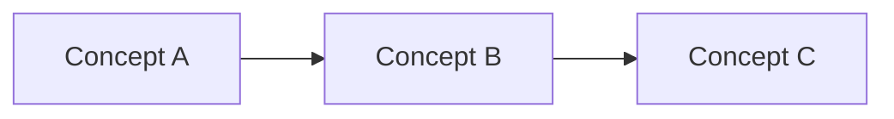

# Style Guide — genai-aws-bedrock-in-practice

**Version**: 1.0  
**Last Updated**: January 2025  
**Purpose**: Ensure consistency, clarity, and maintainability across all content

---

## Table of Contents

1. [Markdown Conventions](#markdown-conventions)
2. [Naming Conventions](#naming-conventions)
3. [Writing Mental Models](#writing-mental-models)
4. [Code Sample Guidelines](#code-sample-guidelines)
5. [Diagram Standards](#diagram-standards)
6. [Content Structure](#content-structure)
7. [Quality Standards](#quality-standards)

---

## Markdown Conventions

### Headers

- Use `#` for document title (Session title)
- Use `##` for major sections
- Use `###` for subsections
- Use `####` sparingly (only if truly needed)

### Lists

- Use `-` for unordered lists
- Use `1.` for ordered lists
- Indent nested lists with 2 spaces
- Add blank lines before and after lists

### Emphasis

- Use `**bold**` for important terms and concepts
- Use `*italic*` for emphasis (sparingly)
- Use `> blockquote` for architect-level insights and key takeaways

### Code Blocks

- Always specify language: ` ```python `, ` ```bash `, etc.
- Use `text` for plain text examples
- Use `mermaid` for diagrams
- Include comments explaining non-obvious code

### Links

- Use relative paths for internal links: `[text](../path/file.md)`
- Use absolute URLs for external links: `[text](https://example.com)`
- Test all links before committing

---

## Naming Conventions

### Session Folders

**Pattern**: `NN_session-topic-kebab/`

**Examples**:
- ✅ `01_bedrock-mental-models/`
- ✅ `02_bedrock-platform-deep-dive/`
- ✅ `05_genai-backend-architecture/`

**Rules**:
- Always use zero-padded numbers (`01_`, `02_`, never `00_`)
- Use kebab-case (lowercase with hyphens)
- Be descriptive but concise

### Session Files

**Pattern**: `NN_module-name.md`

**Examples**:
- ✅ `01_overview.md`
- ✅ `02_core-mental-models.md`
- ✅ `03_tokens.md`
- ✅ `04_terminology-and-scope.md`

**Rules**:
- Overview is always `01_overview.md`
- Modules start at `02_` and increment
- Use semantic names (not `Part1`, `Part2`)
- Keep names URL-friendly (lowercase, hyphens)

### Code Files

**Pattern**: Language-specific conventions

**Examples**:
- Python: `bedrock_hello_inference.py`
- JavaScript: `bedrockHelloInference.js`
- TypeScript: `bedrockHelloInference.ts`

---

## Writing Mental Models

### Structure

1. **Start with the "Why"**
   - Why does this concept matter?
   - What problem does it solve?

2. **Define the Concept**
   - Clear, concise definition
   - What it is and what it is NOT

3. **Provide Context**
   - Where does this fit in the bigger picture?
   - How does it relate to other concepts?

4. **Include Architect-Level Insights**
   - Trade-offs and constraints
   - Production considerations
   - Failure modes

### Example Pattern

```markdown
## [Concept Name]

> [One-line definition or key insight]

[Expanded explanation]

### What [Concept] Is NOT

* ❌ Not [common misconception 1]
* ❌ Not [common misconception 2]

### Architect-Level Insight

> [Key takeaway for system designers]
```

### Analogies

- Use analogies to explain complex concepts
- Keep analogies simple and relatable
- Example: "Bedrock as Power Grid" (you consume, don't build)

---

## Code Sample Guidelines

### Principles

1. **Minimal and Illustrative**
   - Show only what's needed to teach the concept
   - Avoid complete implementations in educational content

2. **Well-Commented**
   - Explain what the code demonstrates
   - Comment non-obvious logic

3. **Production-Aware**
   - Include error handling considerations
   - Mention security implications
   - Note cost considerations

4. **Language-Agnostic When Possible**
   - Focus on concepts over syntax
   - Use pseudocode if language doesn't matter

### Example Structure

```python
# Minimal example demonstrating [concept]
# This shows [what it teaches]

import boto3

# Initialize Bedrock client
bedrock = boto3.client('bedrock-runtime', region_name='us-east-1')

# [Key concept demonstration]
# Note: In production, add error handling and cost monitoring
```

### Full Code Location

- Minimal examples in session content
- Full implementations in `src/` directory
- Link from session to full code when applicable

---

## Diagram Standards

### Mermaid-First Approach

**Primary**: Use Mermaid diagrams  
**Fallback**: Include ASCII text version

### Example Pattern

```markdown


**Text Hierarchy (ASCII fallback):**

```text
Concept A
   └── Concept B
         └── Concept C
```
```

### Diagram Guidelines

- Keep diagrams simple and focused
- Use consistent styling
- Never embed copyrighted figures
- Test Mermaid rendering before committing

---

## Content Structure

### Session Overview (01_overview.md)

**Required Sections**:
- YAML frontmatter with all required fields
- Session title and metadata
- Module list with links
- Output artifact description

### Module Files (02_...md, etc.)

**Recommended Structure**:
1. YAML frontmatter
2. Module title
3. Main concept
4. Key points or examples
5. Architecture considerations
6. Architect-level insights
7. Navigation (next module or overview)

### Line Limits

- **Target**: ≤150 lines per file (excluding YAML)
- **Action if exceeded**: Split into additional modules
- **Never**: Trim content to fit (always split)

---

## Quality Standards

### Before Publishing

- [ ] YAML frontmatter is complete and valid
- [ ] All file references point to existing files
- [ ] Learning objectives are specific and measurable
- [ ] Content follows architecture-first approach
- [ ] Production considerations are included
- [ ] Diagrams render correctly
- [ ] Code examples are minimal and illustrative
- [ ] No placeholder text remains
- [ ] Markdown linting passes
- [ ] Links are tested and working

### Content Quality

- ✅ **Clear objectives**: Learners know what they'll achieve
- ✅ **Progressive scaffolding**: Builds on previous concepts
- ✅ **Original examples**: Not copied from sources
- ✅ **Practical relevance**: Real-world applicability
- ✅ **Architect-level insights**: System design thinking

### Zero-Copy Policy

- ❌ Never copy text verbatim from sources
- ❌ Never mirror source outlines or structure
- ✅ Always create transformative, original content
- ✅ Use sources for inspiration, not replication

---

## Common Patterns

### Defining Terms

```markdown
| Term | One-liner | What It Describes |
|------|-----------|-------------------|
| **Term** | Brief definition | Category/context |
```

### Architect-Level Insights

```markdown
> **Architect-level insight:** [Key takeaway for system designers]
```

### Production Considerations

```markdown
## Production Considerations

- **Security**: [Security implications]
- **Cost**: [Cost considerations]
- **Observability**: [Monitoring needs]
- **Failure Modes**: [What can go wrong]
```

### Navigation

```markdown
---

## What's Next

Continue to [next module](03_next-module.md) or return to [overview](01_overview.md).
```

---

## Validation

### Automated Checks

Run before committing:

```bash
# Markdown linting
npx markdownlint-cli2 "docs/sessions/**/*.md"

# Link checking
docker run --rm -v "${PWD}:/workspace" lycheeverse/lychee "docs/sessions/**/*.md"
```

### Manual Checks

- [ ] Read through content for clarity
- [ ] Verify all examples work (if runnable)
- [ ] Test all links
- [ ] Check diagram rendering
- [ ] Review for consistency with style guide

---

## Related Resources

- [Session Overview](04_session-overview.md) - **Single source of truth** for session roadmap
- [Session Template](templates/session-template.md)
- [Session Index Dashboard](sessions/README.md)
- [Contributing Guidelines](../../CONTRIBUTING.md)

---

**Remember**: This style guide exists to ensure consistency and quality. When in doubt, prioritize clarity and educational value over strict adherence to rules.

