# Session 01: Bedrock Mental Models & GenAI Foundations

* **Event URL:** <https://www.meetup.com/dot-net-learners-house-hyderabad/events/312511436>
* **Duration:** ~30 minutes
* **Type:** Conceptual (mental models first, tooling later)
* **Deliverable:** One-page *Bedrock Mental Model* note + glossary
* **Part of:** `genai-aws-bedrock-in-practice`
* **Organization:** aws-learning-journey-2026

---

## 1. Objective

By the end of this session, you should be able to:

* Explain what **Generative AI** is in practical terms
* Describe what a **foundation model** is and why it matters
* Clearly articulate **what Amazon Bedrock is and is not**
* Place **Amazon Bedrock correctly within the AWS AI/ML ecosystem**

### Why This Matters

> **These are very common assumptions — I’ve made them myself.**

Many challenges with Generative AI on AWS begin `before any code is written`:

* Amazon Bedrock is frequently misunderstood in relation to SageMaker
* LLMs are often approached as deterministic APIs rather than probabilistic systems
* System designs may overlook token-based cost and variability in outputs

Without the right mental model, early design decisions can lead to unnecessary complexity, higher costs, or fragile systems. This session exists to establish that foundation before moving into tools and implementation.

---

Below is a **clean, updated version** of the sections you shared, with the following improvements applied:

* Explicitly defines **“Model”** (this removes ambiguity early)
* Keeps the hierarchy **Bedrock-centric**
* Tightens language without adding theory
* Maintains a calm, architect-grade tone
* Ready to paste directly into your document

No new concepts were introduced—only clarified.

---

## 2. Core Mental Models

### 2.1 The Minimal AI Hierarchy (For Bedrock Users)

For **using Amazon Bedrock**, you only need the following conceptual hierarchy.
This is an **orientation model**, not a training guide.

#### The AI Hierarchy (Minimal Mental Model)

```mermaid
graph LR
    A[Artificial Intelligence<br/>Systems that perceive, reason, and act] --> B[Machine Learning<br/>Learn patterns from data]
    B --> C[Neural Networks<br/>Function approximators]
    C --> D[Deep Learning<br/>Large networks, complex representations]
    D --> E[Generative AI<br/>Generate new content]
    E --> F[Foundation Models<br/>Pre-trained, reusable]
    F --> G[Amazon Bedrock<br/>Managed inference platform]
    
    style A fill:#E3F2FD,stroke:#1976D2,stroke-width:2px
    style G fill:#E8F5E9,stroke:#388E3C,stroke-width:3px
    style E fill:#FFF3E0,stroke:#F57C00,stroke-width:2px
```



**Text Hierarchy (ASCII fallback):**

```text
Artificial Intelligence
   └── Machine Learning
         └── Neural Networks
               └── Deep Learning
                     └── Generative AI
                           └── Foundation Models (via Amazon Bedrock)
```

> Everything below **Generative AI** is intentionally **abstracted away** by Amazon Bedrock.

As Bedrock users, we design **systems and workflows**, not **models or training pipelines**.

---

### 2.2 Essential Concepts (Orientation Only)

These definitions are intentionally concise.
They exist to **align vocabulary**, not to teach internals.

| Concept                          | One-line Definition                                                                 |
| -------------------------------- | ----------------------------------------------------------------------------------- |
| **Model**                        | A trained function that maps inputs to outputs based on patterns learned from data  |
| **Artificial Intelligence (AI)** | The broad goal of building systems that can perceive, reason, and act intelligently |
| **Machine Learning (ML)**        | Systems that learn patterns from data instead of being explicitly programmed        |
| **Neural Networks**              | Function approximators that learn complex mappings between inputs and outputs       |
| **Deep Learning**                | Uses large neural networks to learn rich representations from massive data          |
| **Generative AI**                | Models that generate new content such as text, images, or code                      |
| **Foundation Models**            | Large, pre-trained models reused across many tasks without training from scratch    |
| **Amazon Bedrock**               | A managed AWS service for running foundation models via APIs                        |

> Clarifying **“Model”** early is critical—everything in Bedrock ultimately revolves around *using models safely and effectively*.

---

## 3. Terminology Clarification

### Foundation Models vs Base Models vs Language Models

These terms are often used interchangeably, but they describe **different dimensions** of a model.

Think of them as answering **different questions**:

* **Base Model** → *What training state is this model in?*
* **Foundation Model** → *How broadly can this model be reused?*
* **Language Model** → *What type of data does this model work with?*

Understanding this distinction prevents confusion when working with Amazon Bedrock.

---

### Practical Definitions

| Term                           | One-liner                                                            | What It Describes |
| ------------------------------ | -------------------------------------------------------------------- | ----------------- |
| **Base Model**                 | A raw, pre-trained model before task-specific tuning or alignment    | Training state    |
| **Foundation Model**           | A large, reusable model designed to support many tasks               | Reusability       |
| **Language Model (LM)**        | A model that understands and generates text                          | Text modality     |
| **Large Language Model (LLM)** | A large-scale language model with strong generalization capabilities | Scale             |

**Important Relationships:**

* Not all foundation models are language models
* Foundation models may be base models or aligned/fine-tuned models
* LLMs are a subset of language models
* Amazon Bedrock uses **“Foundation Models”** because it supports text, image, embedding, and multimodal models

---

### Architect Takeaway

When designing systems with Bedrock:

* You **consume foundation models**
* You do **not manage base models**
* You may use **language models**, but not always
* Think in terms of **capabilities, cost, and constraints**, not training internals

---

## 4. Generative AI (Practically Defined)

Generative AI refers to models that **produce new content** based on learned patterns.

### Key Characteristics

* **Probabilistic** – same input may yield different outputs
* **Context-dependent** – output quality depends on prompt and context
* **Parameter-driven** – behavior is influenced by model parameters

This is fundamentally different from deterministic APIs.

---

## 5. Foundation Models

A **foundation model** is a large, pre-trained model that can be adapted to many tasks **without training from scratch**.

### Common Tasks

* Text generation and summarization
* Question answering
* Image generation
* Embedding creation

Foundation models trade **generality** for **cost and control**.

---

## 6. What Amazon Bedrock Is

Amazon Bedrock is a **fully managed AWS service** that provides:

* API access to multiple foundation models
* Serverless inference (no infrastructure to manage)
* Enterprise-grade security and governance
* Model choice without vendor lock-in

> Bedrock is about **using models**, not training them.

---

## 7. What Amazon Bedrock Is Not

Amazon Bedrock is **not**:

* A chatbot product
* A UI-first AI tool
* A replacement for SageMaker training workflows
* A framework like LangChain
* A deep learning tutorial platform

Bedrock is an **inference platform**, not an application or training service.

---

## 8. What Is Intentionally Out of Scope

This session and repository **do not cover**:

* Neural network internals
* Backpropagation and optimizers
* CNN, RNN, LSTM architectures
* Model training pipelines
* Transfer learning mathematics

**Why:** Amazon Bedrock deliberately abstracts these away.

If asked:

> *“Don’t these models use neural networks?”*

**Answer:**

> *Yes — but Bedrock abstracts that away. As users, we design systems, not models.*

---

## 9. Where Bedrock Fits in AWS

Think of AWS AI/ML services as layers:

* **High-level APIs:** Rekognition, Comprehend (task-specific)
* **Foundation model access:** Amazon Bedrock
* **Custom ML workflows:** Amazon SageMaker

Bedrock fills the gap between **fully managed AI APIs** and **full ML engineering**.

---

## 10. Architecture Mental Model

### The “Power Grid” Analogy

Think of Amazon Bedrock as a **power grid**:

* You don’t build the power plant (AWS manages models)
* You choose how much power you draw (model + parameters)
* You pay for what you consume (tokens)
* Your system determines efficiency and reliability

Bedrock gives **capability**, not **guarantees**.

---

## 11. Applied Reasoning Example

### Scenario

A team wants to build a **document summarization feature**.

### Decision Reasoning

* Foundation models handle summarization well
* Bedrock provides managed inference and multiple model choices
* No need for custom training or infrastructure

### Conclusion

**Amazon Bedrock is the correct choice**.

### When to Use Bedrock

* Standard GenAI tasks (summarization, Q&A, generation)
* AWS-native security and governance required
* Serverless, pay-per-use model preferred

### When NOT to Use Bedrock

* Need to train custom models → SageMaker
* Need deterministic outputs → traditional services
* Hard real-time constraints → caching or alternative designs

---

## 12. Common Failure Modes

* Treating outputs as deterministic
* Assuming one model fits all tasks
* Ignoring token-based cost implications
* Skipping retrieval (RAG) for real systems
* Deferring cost considerations

Correct mental models prevent these failures.

---

## 13. Output Artifact

### Deliverable

Create a **one-page Bedrock Mental Model note** containing:

1. What Bedrock is and is not
2. The power grid analogy
3. Key vocabulary
4. Core decision principles

Suggested filename:

```
bedrock-mental-model.md
```

---

## 14. Key Takeaways

* Generative AI is probabilistic by nature
* Foundation models are powerful but not magic
* Amazon Bedrock provides managed access, not training
* Mental models matter more than tools
* Understanding precedes optimization

---

## 15. What’s Next

**Session 02 – Amazon Bedrock Platform Deep Dive (Console-First)**

* Bedrock architecture
* Model catalog and selection
* Inference parameters
* Pricing and cost control
* Security and governance

---

**Session Status:** Complete ✅

---

If you want, the next logical step is to **design Session 02** with the same consolidation and delivery discipline.
