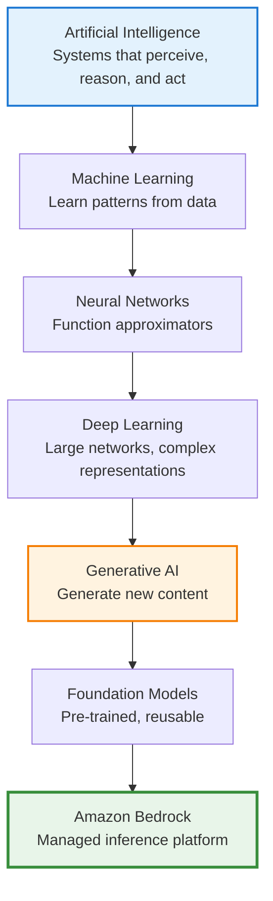

# Session 01: Bedrock Mental Models & GenAI Foundations

**Duration**: ~30 minutes  
**Date**: December 27, 2025  
**Deliverable**: One-page "Bedrock mental model" note + glossary

---

## 1. Objective (1–2 minutes)

**What you'll learn:**

* Explain what Generative AI is in practical terms
* Describe what a foundation model is and why it matters
* Clearly articulate **what Amazon Bedrock is and is not**
* Place Amazon Bedrock correctly within the AWS AI/ML ecosystem

**Why it matters:**

Most failures with Generative AI on AWS happen **before code is written**:

* Teams confuse Bedrock with SageMaker
* Developers treat LLMs like deterministic APIs
* Architects design systems without understanding token costs or model behavior

Without the right mental model, every design decision downstream is flawed. This session establishes the conceptual foundation required for **all subsequent sessions**.

This session focuses on **understanding**, not tooling.

---

## 2. Core Concepts (10–12 minutes)

### Mental Models

#### The AI Hierarchy (Minimal Mental Model)

For **Bedrock usage**, you only need to understand this simple hierarchy:



**Text Hierarchy (ASCII fallback):**

```text
Artificial Intelligence
   └── Machine Learning
         └── Neural Networks
               └── Deep Learning
                     └── Generative AI
                           └── Foundation Models (via Amazon Bedrock)
```

**Essential Concepts (One-liners for orientation):**

| Concept | Definition |
|---------|------------|
| **Artificial Intelligence (AI)** | The broad goal of building systems that can perceive, reason, and act intelligently |
| **Machine Learning (ML)** | Systems that learn patterns from data instead of being explicitly programmed |
| **Neural Networks** | Function approximators inspired by the brain, forming the foundation of modern ML |
| **Deep Learning** | Uses large neural networks to automatically learn complex representations from massive data |
| **Generative AI** | Uses large pre-trained models to generate new content such as text, images, or code |
| **Foundation Models** | Large, pre-trained models reused across many tasks without training from scratch |
| **Amazon Bedrock** | A managed AWS service for running foundation models via APIs |

**Important Note**: While this hierarchy shows the progression from AI to Bedrock, **Bedrock abstracts away the implementation details** (neural networks, deep learning internals). As Bedrock users, we focus on **using foundation models effectively**, not understanding how they're trained.

**Important**: This session focuses on **using Bedrock**, not understanding how models are trained. Bedrock deliberately abstracts away implementation details like neural networks, backpropagation, and training pipelines.

#### Generative AI (Practically Defined)

Generative AI refers to models that **produce new content** — text, images, code, or embeddings — based on patterns learned from large datasets.

**Key characteristics:**

* **Probabilistic, not deterministic** — Same input can produce different outputs
* **Context-dependent** — Output quality varies based on context and instructions
* **Parameter-influenced** — Behavior is influenced by both prompt and parameters

#### Foundation Models

A **foundation model** is a large, pre-trained model that can be adapted to many tasks without training from scratch.

**Examples of tasks:**

* Text generation
* Summarization
* Question answering
* Image generation
* Embedding creation

Foundation models trade **generality** for **cost and control**.

#### What Amazon Bedrock Is

Amazon Bedrock is a **fully managed AWS service** that provides:

* API access to multiple foundation models
* Serverless inference (no infrastructure management)
* Enterprise-grade security and governance
* Model choice without vendor lock-in

**Bedrock is about using models, not training them.**

#### What Amazon Bedrock Is Not

Amazon Bedrock is **not**:

* A chatbot product
* A UI-first AI tool
* A replacement for SageMaker training workflows
* A framework like LangChain
* A deep learning tutorial platform

**Bedrock is an inference platform, not an application or training service.**

#### What's Intentionally Out of Scope

This session (and this repository) does **not** cover:

* How neural networks work internally
* Backpropagation, optimizers, or training algorithms
* CNN, RNN, LSTM architectures
* Transfer learning mathematics
* Model training pipelines

**Why**: Bedrock abstracts these away. As Bedrock users, we design systems and make architectural decisions, not train models.

If someone asks: *"Don't these models use neural networks?"*

**Answer**: *"Yes — but Bedrock deliberately abstracts that away. As users, we design systems, not models."*

#### Where Bedrock Fits in AWS

Think of AWS AI/ML as layers:

* **High-level APIs**: Rekognition, Comprehend (task-specific, fully managed)
* **Foundation model access**: Amazon Bedrock (model choice, inference control)
* **Custom ML workflows**: Amazon SageMaker (training, custom models)

Bedrock fills the gap between **fully managed APIs** and **full ML engineering**.

### Key Vocabulary

| Term | Definition |
|------|------------|
| **Generative AI** | Models that produce new content based on learned patterns |
| **Foundation Model** | Large, pre-trained model adaptable to many tasks |
| **Inference** | The process of using a trained model to generate outputs |
| **Token** | Basic unit of text processing (words, subwords, or characters) |
| **Prompt** | Input text that guides model behavior |
| **Bedrock** | AWS managed service for foundation model inference |

### Architecture Considerations

**The "Power Grid" Analogy:**

Think of Amazon Bedrock as a **power grid**:

* You don't build the power plant (AWS manages the models)
* You choose how much power you draw (select model and parameters)
* You pay for what you consume (pay per token)
* Your application is responsible for how electricity is used (your system design determines cost, quality, and reliability)

Bedrock gives you **capability**, not **guarantees**.

### Constraints & Trade-offs

* **Generality vs. Control**: Foundation models are general-purpose but require careful prompt engineering
* **Cost vs. Quality**: Higher-quality models typically cost more per token
* **Simplicity vs. Flexibility**: Managed service simplifies operations but limits customization
* **Probabilistic vs. Deterministic**: Generative outputs vary, requiring robust error handling

---

## 3. Hands-on / Applied Reasoning (12–15 minutes)

### Example Scenario

**Scenario**: A team wants to build a document summarization feature. They're considering:

* Using Amazon Bedrock
* Building a custom model with SageMaker
* Using a third-party API

**Question**: How should they think about this decision?

### Step-by-Step Reasoning

1. **Understand the requirement**: Document summarization is a well-defined task that foundation models handle well.

2. **Evaluate Bedrock fit**:

   * Bedrock provides multiple models optimized for summarization
   * No need to train or maintain infrastructure
   * Cost scales with usage (pay per token)

3. **Compare alternatives**:

   * **SageMaker**: Overkill for standard summarization; only needed for custom training
   * **Third-party API**: Possible, but loses AWS integration, security, and governance benefits

4. **Decision**: Bedrock is the right choice for this use case.

### Decision Points

**When to use Bedrock:**

* Standard tasks (summarization, Q&A, text generation)
* Need multiple model options
* Want AWS-native security and governance
* Prefer serverless, pay-per-use model

**When NOT to use Bedrock:**

* Need to train custom models (use SageMaker)
* Require deterministic outputs (use traditional APIs)
* Need real-time, low-latency responses (consider caching strategies)

### Failure Modes

**Common misconceptions that lead to poor architecture:**

* ❌ "Bedrock responses are deterministic like REST APIs" → Leads to brittle error handling
* ❌ "One model works best for everything" → Results in poor cost/quality trade-offs
* ❌ "Higher temperature always means better output" → Causes inconsistent results
* ❌ "RAG is optional for real systems" → Leads to hallucination issues
* ❌ "Cost issues can be solved later" → Results in budget overruns

**How to think about it:**

Each assumption leads to poor architecture. Start with correct mental models, then optimize.

---

## 4. Output Artifact + Recap (2–5 minutes)

### Deliverable

### One-page "Bedrock Mental Model" note + glossary

Create a concise reference document that captures:

1. **Bedrock Mental Model** (one paragraph):

   * What Bedrock is (managed inference platform)
   * What it's not (training platform, chatbot product)
   * The power grid analogy
   * Key principle: Bedrock gives capability, not guarantees

2. **Glossary** (key terms):

   * Generative AI
   * Foundation Model
   * Inference
   * Token
   * Prompt
   * Bedrock

**Artifact**: Save as `bedrock-mental-model.md` or similar for future reference.

### Key Takeaways

* ✅ Generative AI outputs are probabilistic and context-dependent
* ✅ Foundation models are powerful but require careful usage
* ✅ Amazon Bedrock provides managed access, not magic solutions
* ✅ Correct mental models reduce cost, rework, and design failures
* ✅ Understanding comes before optimization or frameworks

### Next Steps

In **Session 02 – Bedrock Platform Deep Dive (Console-First)**, we will:

* Explore Bedrock's architecture and service design
* Understand the model catalog and selection criteria
* Break down inference parameters (temperature, top-p, etc.)
* Discuss pricing models and cost implications
* Review security and governance features

👉 Continue to: [`02_bedrock-platform-deep-dive.md`](02_bedrock-platform-deep-dive.md)

### References

* [Amazon Bedrock Documentation](https://docs.aws.amazon.com/bedrock/)
* [AWS AI/ML Services Overview](https://aws.amazon.com/machine-learning/)
* [Foundation Models Explained](https://aws.amazon.com/what-is/foundation-models/)

---

## Production Considerations

Even at this foundational stage, consider:

* **Security**: Bedrock uses IAM for access control; plan your security model early
* **Cost**: Token-based pricing means prompt size directly impacts cost
* **Observability**: Logging and monitoring are essential for probabilistic systems
* **Failure modes**: Design for variability in outputs, not just success paths

---

**Session Status**: Complete ✅

