# Session 01 (Module): Core Mental Models

## The Minimal AI Hierarchy (For Bedrock Users)

For **using Amazon Bedrock**, you only need the following conceptual hierarchy.
This is an **orientation model**, not a training guide.

### The AI Hierarchy (Minimal Mental Model)

```mermaid
graph LR
    A[Artificial Intelligence<br/>Systems that perceive, reason, and act] --> B[Machine Learning<br/>Learn patterns from data]
    B --> C[Neural Networks<br/>Function approximators]
    C --> D[Deep Learning<br/>Large networks, complex representations]
    D --> E[Generative AI<br/>Generate new content]
    E --> F[Foundation Models<br/>Pre-trained, reusable]
    F --> G[Amazon Bedrock<br/>Managed inference platform]
    
    style A fill:#E3F2FD,stroke:#1976D2,stroke-width:2px
    style G fill:#E8F5E9,stroke:#388E3C,stroke-width:3px
    style E fill:#FFF3E0,stroke:#F57C00,stroke-width:2px
```



**Text Hierarchy (ASCII fallback):**

```text
Artificial Intelligence
   └── Machine Learning
         └── Neural Networks
               └── Deep Learning
                     └── Generative AI
                           └── Foundation Models (via Amazon Bedrock)
```

> Everything below **Generative AI** is intentionally **abstracted away** by Amazon Bedrock.

As Bedrock users, we design **systems and workflows**, not **models or training pipelines**.

---

## What Is a Model? (Practically Defined)

> A **model** is a mathematical function that has learned patterns from data and can use those patterns to produce outputs for new inputs.

**Key point:** Humans write code. Models learn behavior.

### Model as a "Learned Mapping"

Think of a model as:

```text
Input  ──► Learned Mapping ──► Output
```

**Examples:**

* Text → next likely words
* Question → answer
* Image prompt → image
* Document → summary
* Text → vector (embedding)

The "mapping" is learned during training, not programmed.

### What a Model Is NOT

Clarifying this avoids confusion later:

* ❌ Not an API
* ❌ Not a chatbot
* ❌ Not a database
* ❌ Not a rules engine
* ❌ Not deterministic logic

A model produces **probabilistic outputs**, not guaranteed results.

> **Architect-level framing:** "A model is not software logic — it's learned behavior. That's why we design guardrails around it."

---

## Essential Concepts (Orientation Only)

These definitions are intentionally concise.
They exist to **align vocabulary**, not to teach internals.

| Concept                          | One-line Definition                                                                 |
| -------------------------------- | ----------------------------------------------------------------------------------- |
| **Model**                        | A trained function that maps inputs to outputs based on patterns learned from data  |
| **Artificial Intelligence (AI)** | The broad goal of building systems that can perceive, reason, and act intelligently |
| **Machine Learning (ML)**        | Systems that learn patterns from data instead of being explicitly programmed        |
| **Neural Networks**              | Function approximators that learn complex mappings between inputs and outputs       |
| **Deep Learning**                | Uses large neural networks to learn rich representations from massive data          |
| **Generative AI**                | Models that generate new content such as text, images, or code                      |
| **Foundation Models**            | Large, pre-trained models reused across many tasks without training from scratch    |
| **Amazon Bedrock**               | A managed AWS service for running foundation models via APIs                        |
