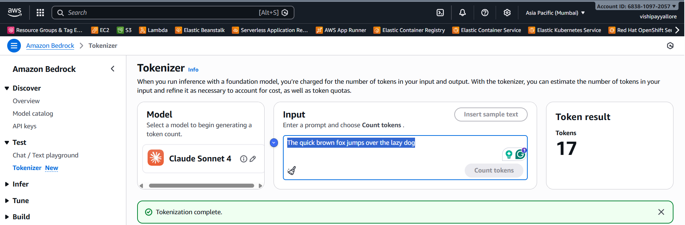

# Session 01 (Module): Understanding Tokens

Tokens are the **basic unit of text processing** in language models. Understanding tokens is essential for:

* **Cost estimation** — Bedrock pricing is token-based
* **Prompt design** — Token limits affect what you can send
* **Performance** — Token count impacts latency and throughput

## How Tokenization Works

## What a Tokenizer Actually Is

A tokenizer is **not just a splitter**. It is a learned encoding system that:

* Breaks text into units (tokens)
* Maps those tokens to numerical IDs
* Is tightly coupled to how the model was trained

> **Tokenizer + Model are a pair.** You cannot mix and match them.

## Key Points

* Tokens are not always words — they can be subwords, parts of words, or even characters
* **Tokenization is model-specific, not universal** — there is no global standard for tokens
* Different models use different tokenizers, vocabularies, and encoding rules
* The same text may have different token counts across models
* Token count directly impacts cost in Bedrock

## Why Tokens Differ Across Models

Each foundation model in Bedrock:

* Uses its **own tokenizer** (trained with the model)
* Has its **own vocabulary**
* Was trained with **different text corpora**
* May use different subword strategies (BPE, WordPiece, Unigram, etc.)

This means the same sentence can be tokenized differently by different models.

### Practical Example

The phrase "Hello, world!" might be tokenized as:

* `["Hello", ",", " world", "!"]` (4 tokens) in one model
* `["Hello", ",", "world", "!"]` (4 tokens) in another model
* Or even `["Hello", ",", " world", "!"]` (3 tokens) in yet another

Same text. Same meaning. **Different tokens.**

## Architect-Level Implication

> **Token count is always model-specific.**

Therefore:

* You **cannot** estimate cost generically across models
* You **must** test token counts with the target model
* You **must** design prompts defensively
* You **must not** assume token counts are universal

This is why production systems:

* Measure tokens dynamically
* Use truncation and summarization
* Rely on RAG to control prompt size

> **Architect-level insight:** When designing systems with Bedrock, always consider token costs. Longer prompts = higher costs. Token counts vary by model, so always test with your target model.

